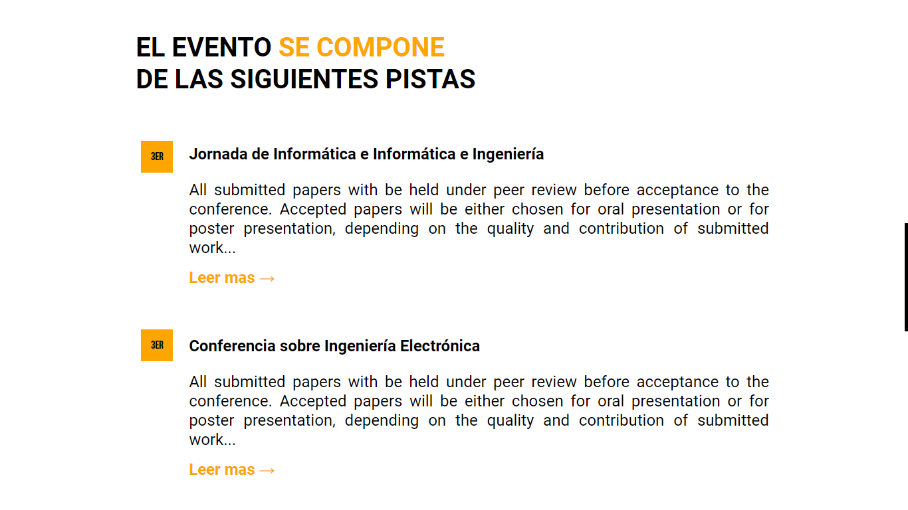
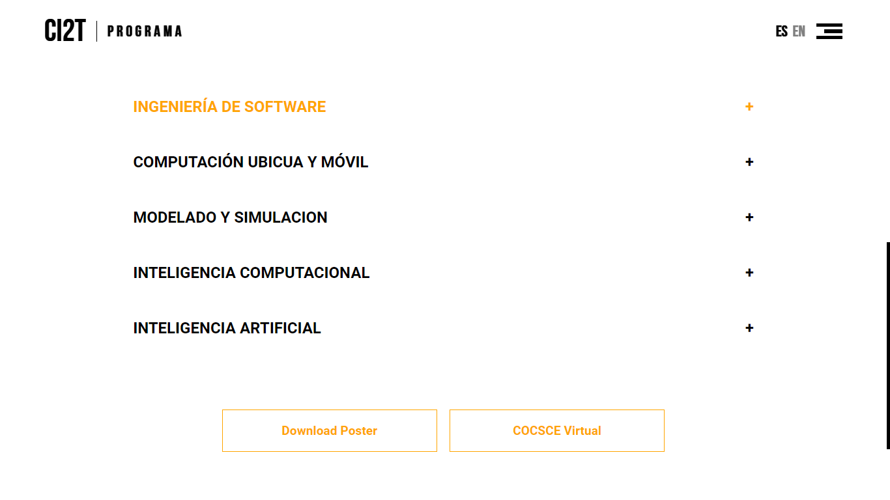
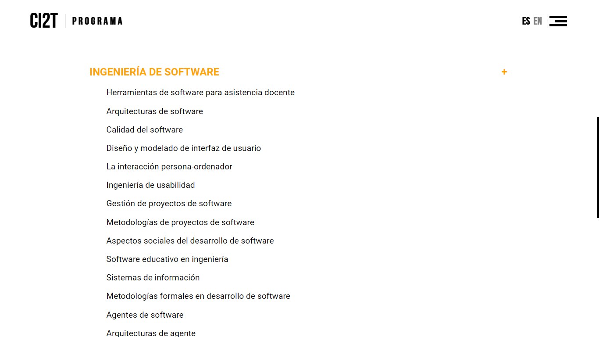

### Configuracion del proyecto
Para modificaciones en desarrollo deben contar con las siguientes herramientas <i>(o modificar html, css y js "de manera nativa")</i>:

* [NodeJs](https://nodejs.org/es/) ::: Ejecuta compilado (descargar del sitio)
* [Pug](https://pugjs.org/api/getting-started.html) -> html
* [Stylus](https://stylus-lang.com/) -> css
* [Typescript](https://www.typescriptlang.org/) -> js

Se pueden instalar mediante los comandos:
~~~bash
npm install pug-cli -g
# or yarn add pug-cli -g

npm install stylus -g
# or yarn add stylus -g

npm install typescript -g
# or yarn add typescript -g
~~~

Al tener todo instalado deben ejecutar los siguientes comandos para encapsular en el html los archivos css y js necesarios, es importante que lo realices en orden.

~~~bash
# transpilado de typescript a vanilla js: *.ts -> *.js
tsc -w ./src/js/*.ts --outDir ./src/js

# transpilado de stylus a pure css: *.styl -> *.css
stylus -w ./src/css/*.styl --include-css --compress -o ./src/css

# transpilado de stylus a pure css: *.styl -> *.css
pug -w ./src/*.pug -E php -o ./public
~~~

Se puede ejecutar el comenado en una sola sentencia desde terminal:
~~~bash
tsc -w ./src/js/*.ts --outDir ./src/js & stylus -w ./src/css/*.styl --include-css --compress -o ./src/css & pug -w ./src/*.pug -E php -o ./public
~~~
---
La estructura del proyecto es la siguiente:
~~~bash
+--- MicroPHP
\--- public
    +--- index.php
\--- src
    +--- components
    +--- css
    +--- js
    ---- index.pug
---- .gitignore
---- index.php
---- readme.md
~~~

* MicroPHP es un microframework creado solo para el manejo de rutas.
* La carpeta public servira los archivos que tendra disponible el enrutador.
* La carpeta src sera ignorada al llevar el proyecto a produccion.
* Los archivos *.css y *.js iran incrustados en el *.html (se incrustan los recursos necesarios con *.pug).

---
### Variables en nuestra vista renderizada
Para variables desde el backend a nuestra plantilla y renderizar en el servidor (SSR), pasamos las variables desde nuestro enrutador:

~~~php
# router.php

$router->get("/", function(Request $req, Response $res) {
    $res->render("home.php", Array(
        "name" => "Medina"
    ));
});
~~~

---

## Capturas de avance

