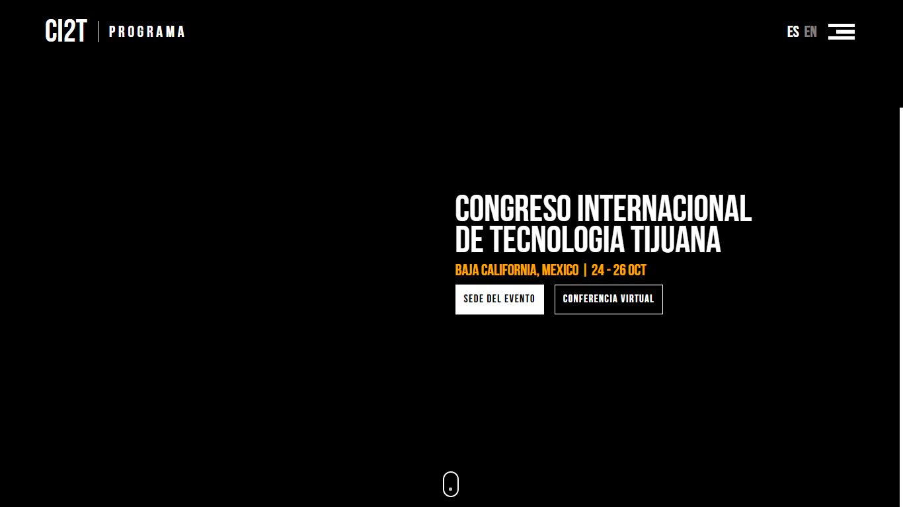

### Configuracion del proyecto
Para modificaciones en desarrollo deben contar con las siguientes herramientas <i>(o modificar html, css y js "de manera nativa")</i>:

La estructura del proyecto es la siguiente:
~~~bash
+--- MicroPHP
\--- public
    +--- index.php
\--- src
    +--- components
    +--- css
    +--- js
    ---- index.pug
---- .gitignore
---- index.php
---- readme.md
~~~

* MicroPHP es un microframework creado solo para el manejo de rutas.
* La carpeta public servira los archivos que tendra disponible el enrutador.
* La carpeta src sera ignorada al llevar el proyecto a produccion.
* Los archivos *.css y *.js iran incrustados en el *.html (se incrustan los recursos necesarios con *.pug).

---
### Variables en nuestra vista renderizada
Para variables desde el backend a nuestra plantilla y renderizar en el servidor, pasamos las variables desde nuestro enrutador:

~~~php
# router.php

$router->get("/", function(Request $req, Response $res) {
    $res->render("home.php", Array(
        "name" => "Medina"
    ));
});
~~~

---

## Capturas de avance

